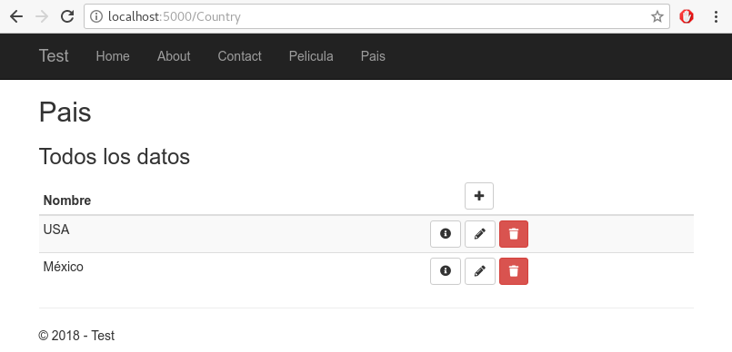

# JCTools.GenericCrud

Simplification of the **C**reate, **R**ead, **U**pdate and **D**elete web pages of the application models.

## Overview

All application required multiple pages for edited the base models. This pages generally are equals to each other.

This package allows reduce this task at minimum of actions.

You only require create and configure your models, and this package create the necessary controllers, views and actions for the **C**reate, **R**ead, **U**pdate and **D**elete actions.

## Status


## Requirements


 or


## Usage

1. Add the package to your application
```bash
Install-Package JCTools.GenericCrud -Version 2.0.0
```
Or
```bash
dotnet add package JCTools.GenericCrud --version 2.0.0
```
2. Add the next lines in the method **ConfigureServices** of your **Startup** class
```cs
    services.ConfigureGenericCrud<MyContext>(o =>
    {
        // Indicate if desired use Modals 
        o.UseModals = true;
        // Set the bootstrap version to be used (default v4.3.1)
        o.BootstrapVersion = Settings.Bootstrap.Version3;
        // add the models type to manage with the package
        o.Models.Add<Models.Country>(); 
        o.Models.Add<Models.Genre>(nameof(Models.Genre.Name));
        o.Models.Add<Models.Movie, int, MovieController, Data.Context>();
    });
```

**Note:** From the version 2.0.0 the next features was marked how to obsolete and will be removed in future versions:
    - The method *o.Models.Add(Type modelType, string keyPropertyName = "Id", string controllerName = "")*.
    - The *ContextCreator* option

3. Add the next line in the **UseMvc** middleware call, this in the method **Configure** of your **Startup** class
 ```cs
 routes.MapCrudRoutes();
 ```
Your code should see similar to the next code
 ```cs
    app.UseMvc(routes =>
    {
        routes.MapCrudRoutes(); // add this line
        routes.MapRoute(
            name: "default",
            template: "{controller=Home}/{action=Index}/{id?}");

    });
 ```
 4. Run to app and access at the url **http://localhost:5000/[ModelName]**, sample: **http://localhost:5000/Country**. In the browser you should see a similar page to :
 

## Custom controllers
If your desired personalize your controllers, add additional actions or override the default actions, then

1. Not add the model to manage in the step 3 of the last section
2. Create a new controller the inherits from **JCTools.GenericCrud.Controllers.GenericController<TDbContext, TModel, TKey>**. sample
```cs
using System;
using JCTools.GenericCrud.Controllers;
using JCTools.GenericCrud.Services;
using Microsoft.AspNetCore.Mvc;
using Microsoft.Extensions.Localization;
using Microsoft.Extensions.Logging;

namespace Test.Controllers
{
    public class MovieController : GenericController<Data.Context, Models.Movie, int>
    {
        public MovieController(IServiceProvider serviceProvider) 
        : base(serviceProvider)
        {}

        public override void OnActionExecuting(ActionExecutingContext filterContext)
        {
            // Add your custom settings here, eg;
            Settings.UseModals = false;
            Settings.Subtitle = "All entities";
            // ...

            base.OnActionExecuting(filterContext);
        }
    }
}
```

**Note:** In the version 2.0.0 the **Settings** property of the controller has initialized in the *OnActionExecuting(ActionExecutingContext filterContext)* or *OnActionExecutionAsync(ActionExecutingContext context, ActionExecutionDelegate next)* controller methods; **You should move their custom settings of the controller constructor to this methods.**

3. **(optional)** If you override the **OnActionExecuting(ActionExecutingContext filterContext)** or **OnActionExecutionAsync(ActionExecutingContext context, ActionExecutionDelegate next)** controller methods, make sure to invoke the base methods for the correct initializations of the controller settings

```cs
    //...
    public override void OnActionExecuting(ActionExecutingContext filterContext)
    {        
        base.OnActionExecuting(filterContext);
        // Add your custom process here

    }
    
    public override Task OnActionExecutionAsync(ActionExecutingContext context, ActionExecutionDelegate next)
    {
        // Add your custom process here
        return base.OnActionExecutionAsync(context, next);
    }
    //...
```

4. Run to app and access at the url **http://localhost:5000/Movie**,
## Changes of the version 2.0.0
* Add support to Bootstrap 4.0
* The follows interfaces was replaced for a best definition and structure:
  * IBase -> IViewModel
  * IBaseDetails, ICrudDetails -> IDetailsModel
  * ICrudEdit -> IEditModel
  * ICrudList -> IIndexModel
* The follows models was replaced by the **CrudModel** class
  * Base
  * CrudDetails
  * CrudEdit
  * CrudList
* The **IControllerOptions** interface and **ControllerOptions** class was removed for being unnecessary in the new structure
* The extensors methods **GetLocalizedString(...)** for the **IStringLocalizer** interfaces was moved to the **StringLocalizerExtensors** class

## License
[MIT License](LICENSE)
