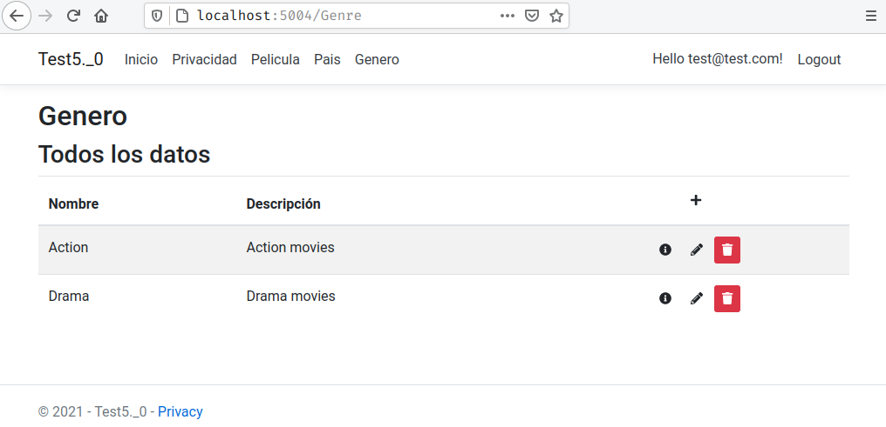
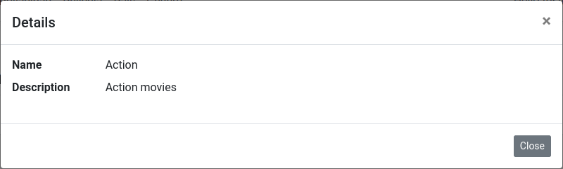

# JCTools.GenericCrud

Simplification of the **C**reate, **R**ead, **U**pdate and **D**elete web pages of the application models.

## Content
- [JCTools.GenericCrud](#jctoolsgenericcrud)
  - [Content](#content)
  - [Overview](#overview)
  - [Status](#status)
  - [Requirements](#requirements)
  - [Usage](#usage)
    - [Basic usage](#basic-usage)
    - [Demo apps](#demo-apps)
  - [Other features](#other-features)
    - [Custom controllers](#custom-controllers)
    - [Entity model property settings](#entity-model-property-settings)
    - [Authorization](#authorization)
    - [Links and HTML anchors](#links-and-html-anchors)
    - [Globalization and localization](#globalization-and-localization)
  - [Api rest](#api-rest)
    - [Supported response mime types](#supported-response-mime-types)
    - [Get all data](#get-all-data)
      - [Request](#request)
      - [Response](#response)
    - [Get entity details](#get-entity-details)
      - [Request](#request-1)
      - [Response](#response-1)
    - [Create a new entity](#create-a-new-entity)
      - [Request](#request-2)
      - [Response](#response-2)
    - [Edit entities](#edit-entities)
      - [Request](#request-3)
      - [Response](#response-3)
    - [Delete entities](#delete-entities)
      - [Request](#request-4)
      - [Response](#response-4)
  - [Release notes](#release-notes)
  - [License](#license)

## Overview

All application required multiple pages for edited the base models. This pages generally are equals to each other.

This package allows reduce this task at minimum of actions.

You only require create and configure your models, and this package create the necessary controllers, views and actions for the **C**reate, **R**ead, **U**pdate and **D**elete actions.


## Status


## Requirements
,
 or 


 or


## Usage
### Basic usage

1. Add the package to your application
    ```bash
    Install-Package JCTools.GenericCrud -Version 2.1.0
    ```
    Or
    ```bash
    dotnet add package JCTools.GenericCrud --version 2.1.0
    ```
2. Add the next lines in the method **ConfigureServices** of your **Startup** class
    ```cs
        services.ConfigureGenericCrud<MyContext>(options =>
        {
            // add the models type to manage with the package
            options.Models.Add<Models.Country>(); 
            options.Models.Add<Models.Genre>(nameof(Models.Genre.Name));
            // ...
            
            // options is an instance from JCTools.GenericCrud.Settings.IOptions
            // use this interface to custom the generated CRUDs globally
            // eg;

            // Indicate if desired use Modals
            options.UseModals = true;
            // Set the bootstrap version to be used (default v4.3.1)
            options.BootstrapVersion = Settings.Bootstrap.Version3;
            
            // add a model with a custom controller
            options.Models.Add<Models.Movie, int, MovieController, Data.Context>();            
        });
    ```
3. Run to app and access at the url **http://localhost:5000/[ModelName]**, sample: **http://localhost:5000/Country**. In the browser you should see a similar page to :
 
 
    > Your app's layout page may make it look different from the images above.

### Demo apps
The current repository include 3 demo apps for showing the described features of the package:
- [.net Core 2.1 demo app](Test)
- [.net core 3.1 demo app](Test3.1)
- [.net 5.0 demo app](Test5.0)

## Other features
### Custom controllers
If your desired personalize your controllers, add additional actions or override the default actions, then

1. Create a new controller the inherits from **JCTools.GenericCrud.Controllers.GenericController**. e.g;
    ```cs
    using System;
    using System.Linq;
    using JCTools.GenericCrud.Controllers;
    using JCTools.GenericCrud.Services;
    using JCTools.GenericCrud.DataAnnotations;
    using Microsoft.AspNetCore.Mvc.Filters;
    using Microsoft.Extensions.Localization;
    using Microsoft.Extensions.Logging;

    namespace MyApp.Controllers
    {
        [CrudConstraint(typeof(Models.MyModel))]
        public class MyController : GenericController
        {
            public MyController(
                IServiceProvider serviceProvider,
                IViewRenderService renderingService,
                IStringLocalizerFactory localizerFactory,
                ILoggerFactory loggerFactory
            )
                : base(serviceProvider, renderingService, localizerFactory, loggerFactory, "Id")
            {
                // add your custom logic here
            }
        }
    }
    ```

2. Add the related model in the method **ConfigureServices** of your **Startup** class using specifying the custom controller, eg;
    ```cs
        options.Models.Add<Models.Movie, int, MovieController, Data.Context>();
    ```

3. **(optional)** If you override the **OnActionExecuting(ActionExecutingContext filterContext)** or **OnActionExecutionAsync(ActionExecutingContext context, ActionExecutionDelegate next)** controller methods, make sure to invoke the base methods for the correct initializations of the controller settings

    ```cs
        // ...
        
        public override void OnActionExecuting(ActionExecutingContext context)
        {
            // Call the initialization of the Settings property
            base.InitSettings(context);
            
            // Add your custom settings here, eg;
            Settings.UseModals = false; // disabled the modals
            Settings.Subtitle = "All entities"; // change the default subtitle
            
            // Customizing the Icons and Buttons Classes of the Index Page
            var index = Settings as IIndexModel;
            index.NewAction.IconClass = "fa fa-plus-circle";
            index.NewAction.ButtonClass = "btn btn-success btn-sm";

            index.DetailsAction.IconClass = "fa fa-info";
            index.DetailsAction.ButtonClass = "btn btn-info btn-sm";
            
            index.EditAction.IconClass = "fa fa-edit";
            index.EditAction.ButtonClass = "btn btn-warning btn-sm";
            
            index.DeleteAction.IconClass = "fa fa-eraser";

            // other things
            ViewBag.Countries = (DbContext as Context).Countries.ToList();

            base.OnActionExecuting(context);
        }
        
        // Or
        public override Task OnActionExecutionAsync(ActionExecutingContext context, ActionExecutionDelegate next)
        {
            // Call the initialization of the Settings property
            base.InitSettings(context);
            // Add your custom settings here, eg;
            Settings.UseModals = false;
            Settings.Subtitle = "All entities";
            ViewBag.OtherEntities = (DbContext as Data.Context).OtherEntities.ToList();

            return base.OnActionExecutionAsync(context, next);
        }
        //...
    ```

4. Run to app and access at the url **http://localhost:5000/[model name]**, e.g. http://localhost:5000/movie

> You can see a sample custom controller in the demo apps called MovieController:
> * [.net Core 2.1 demo app](Test/Controllers/MovieController.cs)
> * [.net core 3.1 demo app](Test3.1/Controllers/MovieController.cs) 
> * [.net 5.0 demo app](Test5.0/Controllers/MovieController.cs)

### Entity model property settings
Version 2.0.0 includes the ability to customize property settings in an entity model.
For this propose using the data annotation **CrudAttribute** in the namespace *JCTools.GenericCrud.DataAnnotations*.

This data annotation have third properties:

 * Visible: Boolean indicating that the property is or not visible in CRUD views.
 * UseCustomView: Boolean indicating that the property has custom views for rendering in details, create, delete, and edit actions.
    > Two custom views are required per property, one for read-only views (Details and Delete actions) and one for editable views (Create and Edit actions).
    > * Readonly views are named _Details<Property name>.cshtml.
    > * Editable views are named _Edit<Property name>.cshtml.    
    > eg; if the property is named *Status*, the CRUD expects to find two views named _DetailsStatus.cshtml and _EditStatus.cshtml.

 * IsEditableKey: Boolean that indicates whether the entity property is an Id/Key and whether or not it is editable by the user.
    > When an Id / Key property is editable, editing the entity is actually a deletion of the stored entity followed by the creation of a new entity using the new values.

### Authorization
JCTool.GenericCrud includes since version 2.1.0 the possibility of managing access to CRUD controllers using an authorization policy.

The name of the default policy is JCTools.GenericCrud.CrudPolicy, and by default authorization is not activated and anonymous access is allowed.

To turn on authorization validation, just add a call to **UseAuthorization** in your *Startup.ConfigureServices* method. e.g;

```cs
    services.ConfigureGenericCrud<MyContext>(options =>
    {
        // ...
        o.UseAuthorization(f => f.RequireAuthenticatedUser()); // add this line
    });
```
> **Note:** If no action is specified for policy validation, by default only one authenticated user is required.
### Links and HTML anchors
To insert a link to a custom CRUD or CRUD, you only need to use ASP.NET Core Anchor Tag Helper.

```html
    <a asp-area="" asp-controller="MyEntity" asp-action="Index">My Label</a>
```
Notice that it was used in the entity model name instead of the controller name.

> **Note:** In .Net Core 2.1 the controller is named **Generic** and is required add the asp-route-entitySettings attribute with the entity model name, eg;
    ```
        <a asp-area="" asp-controller="Generic" asp-action="Index" asp-route-entitySettings="MyEntity">My Label</a>
    ```

### Globalization and localization
By default, generic CRUDs support ASP.NET globalization and localization, as described in the official [documentation](https://docs.microsoft.com/en-us/aspnet/core/fundamentals/localization?view=aspnetcore-5.0).

But only the english and spanish languages are included into the package.

You can extend or replace the included localized strings with your own translations by following the steps below:

1. Generate your own resources files (.rex), according the official documentation
2. Include the same keys that contains the include files [I18N.resx](JCTools.GenericCrud/Resources/I18N.resx) and [I18N.es.resx](JCTools.GenericCrud/Resources/I18N.es.resx)
3. Configure your **startup** class for use the globalization and localization middleware
4. Modify the initialization of the GenericCrud in the method **ConfigureServices** of your **Startup** class for include the next line:
   
   ```cs
    services.ConfigureGenericCrud<MyContext>(options =>
    {
        // ...
        o.ReplaceLocalization(Resources.MyResourcesClass.ResourceManager); // add this line
    });
    ```
    The *Resources.MyResourcesClass.ResourceManager* corresponds to the property *ResourceManager* of the autogenerated file in the step 1

## Api rest

The package enable for each of the configured models a API rest for interact with the related data to the specified model.

If you specified the **Accept** header in the request then the package return the found data in the specified mimetype. 

### Supported response mime types

**application/json** and **application/xml** are the supported MIME types; but, if you specified another mimetype, the package will return an html view with the data found in the response.


### Get all data

> GET http://host:post/{entity}/{id}

Allows get all related data of the specified entity. It's equivalent to the **Index** action of the CRUD.

#### Request

**Path parameters**

- **entity** parameter (required): Is the name of the model related of the desired entities. It should be corresponds with any of the configured models into the startup class.

- **id** parameter (optional): Is the Id or Key value of a specific entity. Use this parameter for get a separated specified entity data of rest of the data.

**Headers**

- **Accept** header (optional): Allows specified the desired mime type to receive into the response. See [Supported response mime types section](#supported-response-mime-types).

#### Response
- By default, the sent response is a html view with the found data using the configured styles by the application. See the images of the [basic usage section](#basic-usage).
- If the **Accept** header is established a response object with the following properties is sent:
    - **Data**: Collection with all found data 
    - **Selected**: Object with the related data to the specified id request parameter. Null if the related entity not exists.
    - **Message**: String with a message for the user related of the executed operation. Empty string if all is OK.
    - The followings are samples of responses:
        - Accept:application/json: 
        ```json
        {
            "data": [
                {
                    "name": "Action",
                    "description": "Action movies"
                },
                {
                    "name": "Drama",
                    "description": "Drama movies"
                }
            ],
            "message": "",
            "selected": {
                "name": "Action",
                "description": "Action movies"
            }
        }
        ```
        - Accept:application/xml
        ```xml
        <Index>
            <Data>
                <Name>Action</Name>
                <Description>Action movies</Description>
            </Data>
            <Data>
                <Name>Drama</Name>
                <Description>Drama movies</Description>
            </Data>
            <Message>Cambios almacenado correctamente.</Message>
            <Selected>
                <Name>Action</Name>
                <Description>Action movies</Description>
            </Selected>
        </Index>
        ```
### Get entity details

> GET http://host:post/{entity}/{id}/details

Allows get all related data to an specific entity, It's equivalent to the CRUD Details action.

#### Request

**Path parameters**

- **entity** parameter (required): Is the name of the model related of the desired entity. It should be corresponds with any of the configured models into the startup class.

- **id** parameter (required): Is the Id or Key value of a specific entity. 

**Headers**

- **Accept** header (optional): Allows specified the desired mime type to receive into the response. See [Supported response mime types section](#supported-response-mime-types).

#### Response
- By default, the sent response is a html view with the found data using the configured styles by the application. 
    The following image correspond to a response for the details request of the model [genre](Test5.0/Models/Genre.cs) of a [demo app](Test5.0).
    
- If the **Accept** header is established a response object with the found entity is send.
    - The followings are examples of equivalent responses to the image above:
        - Accept:application/json: 
        ```json
        {
            "name": "Action",
            "description": "Action movies"
        }
        ```
        - Accept:application/xml
        ```xml
        <Genre>
            <Name>Action</Name>
            <Description>Action movies</Description>
        </Genre>
        ```

### Create a new entity

> POST http://host:post/{entity}

Allows create a new entity specifying the entity data, It's equivalent to the CRUD Create action.

#### Request

**Path parameters**

- **entity** parameter (required): Is the name of the model related of the new entity. It should be corresponds with any of the configured models into the startup class.

**Headers**

- **Content-Type** header (required): Used for specifying the content type of the data sent to the api. See [Supported response mime types section](#supported-response-mime-types) for the possible values.

**Body**

A serialized object with the required data for the specified model type.
> In the xml requests is required that the root element was named **data**

**Example**

The following js code is used for create a new entity of the model [Country](Test5.0/Models/Country.cs) in the Demo app:

- For JSON content:
    ```js
    var myHeaders = new Headers();
    myHeaders.append("Content-Type", "application/json");
    
    var requestOptions = {
        method: 'POST',
        headers: myHeaders,
        body: JSON.stringify({"Name":"A new country"}),
        redirect: 'follow'
    };

    fetch("http://host:port/Country", requestOptions)
        .then(response => response.text())
        .then(result => console.log(result))
        .catch(error => console.log('error', error));
    ```
- For XML content:
    ```js
    var myHeaders = new Headers();
    myHeaders.append("Content-Type", "application/xml");

    var requestOptions = {
        method: 'POST',
        headers: myHeaders,
        body: "<data><Name>A new country.</Name></data>",
        redirect: 'follow'
    };

    fetch("http://host:port/Country", requestOptions)
        .then(response => response.text())
        .then(result => console.log(result))
        .catch(error => console.log('error', error));   
    ```

#### Response

If the creation is successful, the API return a object serialized in XML or JSON depending of the **Content-Type** header value, with the following properties:

- **Success**: True if the operation was successful; else, false. 
- **Data**: A serialized object with all related data of the new created entity if the **Success** property is true; else, a string collection with the error messages
  
**Example**

Continuing with the previous example seen for the request; the responses in XML and JSON would be:

- Content-Type:application/json: 
    ```json
    {
        "success": true,
        "data": {
            "id": 7,
            "name": "A new country"
        }
    }
    ```

- Content-Type:application/xml
    ```xml
    <Country>
        <Success>true</Success>
        <Data>
            <Id>7</Id>
            <Name>Country from xml</Name>
        </Data>
    </Country>
    ```

### Edit entities

> PUT http://host:post/{entity}

Allows update previously created entities specifying the new data for the entity, It's equivalent to the CRUD Edit/Update action.

#### Request

**Path parameters**

- **entity** parameter (required): Is the name of the model related of the new entity. It should be corresponds with any of the configured models into the startup class.

- **id** parameter (required): Is the Id or Key value of a specific entity. 

**Headers**

- **Content-Type** header (required): Used for specifying the content type of the data sent to the api. See [Supported response mime types section](#supported-response-mime-types) for the possible values.

**Body**

A serialized object with the new data for the entity to update.
> Is required that this object contains the id/key property of the entity for the correct validation.
>
> In the xml requests is required that the root element was named **data**

**Example**

The following js code is used for create a new entity of the model [Country](Test5.0/Models/Country.cs) in the Demo app:

- For JSON content:
    ```js
    var myHeaders = new Headers();
    myHeaders.append("Content-Type", "application/json");

    var raw = ;

    var requestOptions = {
        method: 'PUT',
        headers: myHeaders,
        body: JSON.stringify({
            "Id":5,
            "Name":"Country edited from JSON data"
        }),
        redirect: 'follow'
    };

    fetch("http://host:port/Country/5", requestOptions)
        .then(response => response.text())
        .then(result => console.log(result))
        .catch(error => console.log('error', error));
    ```
- For XML content:
    ```js
    var myHeaders = new Headers();
    myHeaders.append("Content-Type", "application/xml");

    var requestOptions = {
        method: 'PUT',
        headers: myHeaders,
        body: "<data><id>5</id><Name>Country edited from xml request</Name></data>",
        redirect: 'follow'
    };

    fetch("http://host:post/Country/5", requestOptions)
        .then(response => response.text())
        .then(result => console.log(result))
        .catch(error => console.log('error', error)); 
    ```

#### Response

If the update process is successful, the API return a object serialized in XML or JSON depending of the **Content-Type** header value, with the following properties:

- **Success**: True if the operation was successful; else, false. 
- **Data**: A serialized object with all related data of the new created entity if the **Success** property is true; else, a string collection with the error messages
  
**Example**

Continuing with the previous example seen for the request; the responses in XML and JSON would be:

- Content-Type:application/json: 
    ```json
    {
        "success": true,
        "data": {
            "id": 5,
            "name": "Country edited from JSON data"
        }
    }
    ```

- Content-Type:application/xml
    ```xml
    <Country>
        <Success>true</Success>
        <Data>
            <Id>5</Id>
            <Name>Country edited from xml request</Name>
        </Data>
    </Country>
    ```


### Delete entities

> DELETE http://host:post/{entity}/{id}

Allows delete all related data to an specific entity, It's equivalent to the CRUD Delete Confirm action.

#### Request

**Path parameters**

- **entity** parameter (required): Is the name of the model related of the desired entity. It should be corresponds with any of the configured models into the startup class.

- **id** parameter (required): Is the Id or Key value of a specific entity. 

#### Response
- HTTP OK (status code 200): The delete action was successful.
- HTTP Internal server error (status code 500): The delete actions cannot executed. Review the app logs for more details.


## Release notes
In this [link](ReleaseNotes.md) you can be the release notes of the package.

## License
[MIT License](LICENSE)